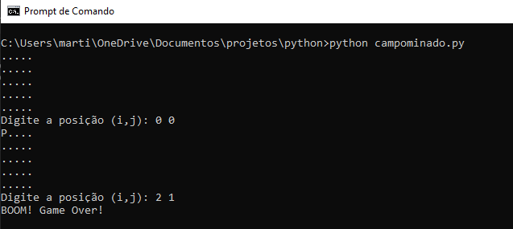

# CampoMinado
Jogo de campo minado em Python para terminal.

Este é um mini projeto em Python feito para revisar os conceitos básicos da linguagem e praticar lógica de programação

<h3>Como jogar: </h3>

O jogo roda através do terminal, onde irá aparecer o campo representado por uma matriz de pontos.

Assim, o jogador digita a posição em que irá estar e sua posição aparecerá no campo como "P".

Se houver uma bomba onde o jogador "pisar", o jogo acaba. Se não, o jogo continua até encontrar uma bomba ou até o número de jogadas acabar.

